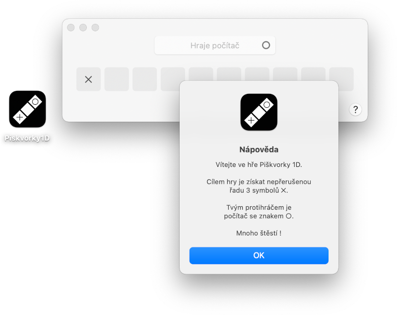

# Piškvorky 1D

> Hra piškvorky v jednorozměrném poli pro Apple macOS

## Základní popis
> Polotovar desktopové aplikace pro macOS

Účelem vývoje bylo především základní seznámení s vývojovým prostředím Xcode a jazykem Swift.

Hlavní okno aplikace obsahuje deset herních políček, do nichž kliknutím zakreslujete svůj symbol „✕“. Cílem je pak získat nepřerušenou řadu 3 políček dříve než protihráč (resp. počítač).

## Technický popis

- při spuštění / restartu hry se náhodně určí, kdo je první na tahu
- herní strategie počítače je založena na náhodě (generování pseudonáhodných čísel)

## Ke stažení

- [macOS 11.4+ (Apple Silicon & Intel)](Piskvorky1D.zip)
