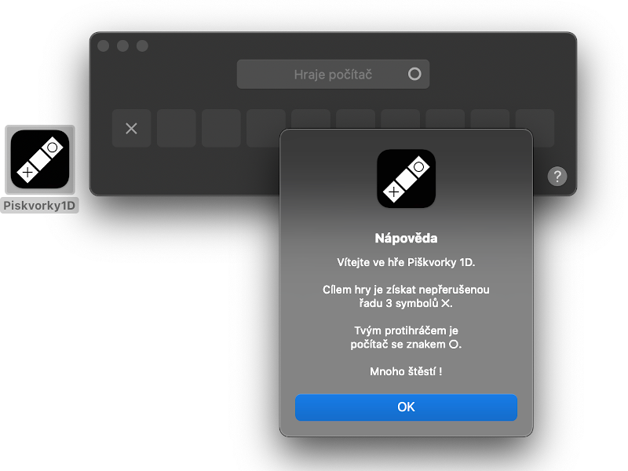

# Piškvorky 1D

> Hra piškvorky v jednorozměrném poli pro Apple macOS

## Ke stažení

- [macOS 11.4+ (Apple Silicon & Intel)](//github.com/ma-ta/piskvorky1d/raw/main/Piskvorky1D.zip)

## Základní popis
> Polotovar desktopové aplikace pro macOS

Účelem vývoje bylo především základní seznámení s vývojovým prostředím Xcode a jazykem Swift.

Hlavní okno aplikace obsahuje deset herních políček, do nichž kliknutím zakreslujete svůj symbol „✕“. Cílem je pak získat nepřerušenou řadu 3 políček dříve než protihráč (resp. počítač).

## Technický popis

- při spuštění / restartu hry se náhodně určí, kdo je první na tahu
- herní strategie počítače je založena na náhodě (generování pseudonáhodných čísel)

## Nutná vylepšení

- refaktoring kódu:
  - ideálně převést do objektového paradigmatu
  - přepsat kód do validního Swift

- herní UX:
  - zlepšit AI počítače (hra je aktuálně nudná)
  - umožnit hrát proti druhému člověku
  - různá velikost herního pole
  - nastavení kritérií výhry (počtu obsazených políček)
  - ukládání / zobrazení výsledků předchozích kol

### Známé chyby:
- po zavření okna se neukončí aplikace:
  - nové okno již nejde otevřít
  - položka Nápověda v hlavním menu zobrazí prázdný dialog
